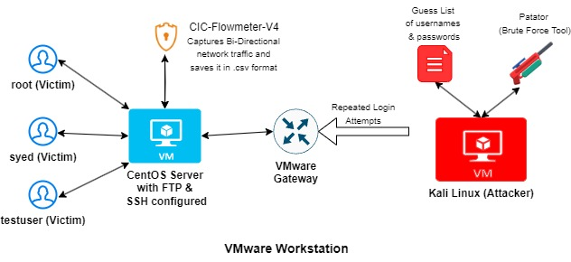
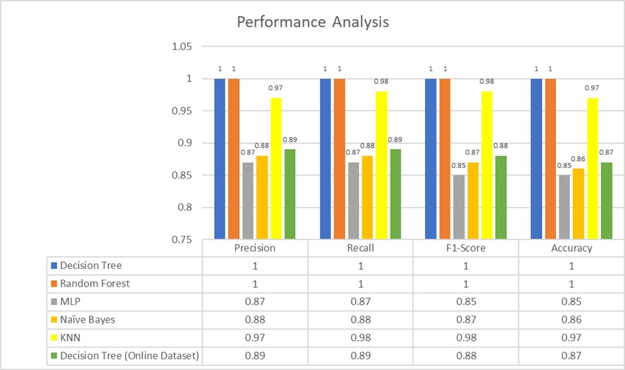
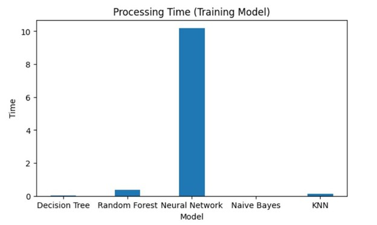
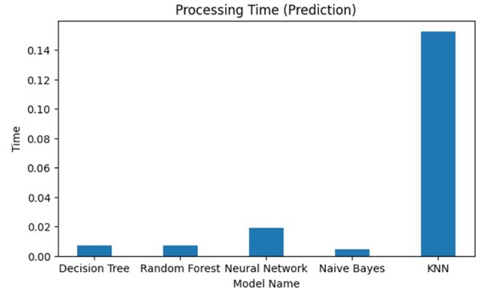

# Machine Learning-Based Intrusion Detection and Response for SSH & FTP Brute Force Attacks

A Machine Learning-based Intrusion Detection System (IDS) designed to detect **SSH and FTP brute force attacks** using the **CSE-CIC-IDS-2018 dataset**.

## Project Overview

This project explores the design and implementation of a Machine Learning-based Intrusion Detection System (IDS) using the CSE-CIC-IDS-2018 dataset, with a focused analysis on SSH and FTP brute force attacks. The workflow includes data preprocessing, exploratory data analysis (EDA), normalization, and feature reduction techniques to optimize model performance while minimizing computational complexity.

Multiple machine learning algorithms were evaluated, including Decision Tree (DT), Naïve Bayes, K-Nearest Neighbors (KNN), Multi-Layer Perceptron (MLP), and Random Forest (RF). Among these, Decision Tree and Random Forest demonstrated superior performance in terms of accuracy, efficiency, and scalability.

## Key Contributions

* Conducted in-depth analysis of large-scale network traffic data related to brute force attacks using the CIC-IDS-2018 dataset
* Identified critical feature dimensions influencing classification performance, improving detection accuracy
* Designed and evaluated ML-based models for detecting SSH and FTP brute force attacks in a NIDS context
* Utilized a custom data collection setup to ensure relevant and high-quality input data
* Performed comprehensive performance evaluation, including accuracy metrics, CPU processing time, and model size for real-world feasibility

The results highlight the importance of algorithm selection in IDS design, with Decision Tree and Random Forest models achieving high precision, recall, F1-score, and overall accuracy. Their fast training and prediction times make them well-suited for real-time intrusion detection environments.

Additionally, the use of feature selection techniques, particularly Random Forest-based importance ranking, significantly reduced model complexity while improving processing efficiency. This enables scalable deployment of IDS solutions in dynamic and resource-constrained environments.

## Workflow
- 1. Data Cleaning & Preprocessing
- 2. Exploratory Data Analysis (EDA)
- 3. Feature Scaling & Normalization
- 4. Feature Selection (Random Forest-based)
- 5. Model Training
- 6. Evaluation & Comparison

## System Architecture

  

## Analysis

### Model Performance

  

### Training Time Comparision

  

### Prediction Time Comparision

  

- Decision Tree & Random Forest achieved the best results:
  - High Accuracy
  - Strong Precision & Recall
  - Fast Training & Prediction

## 📺 Project Presentation

